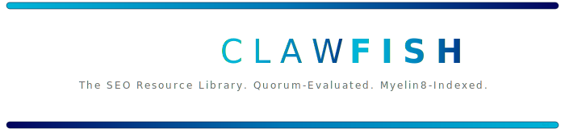
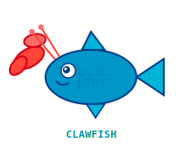

  <picture>
    <source media="(prefers-color-scheme: dark)" srcset="docs/assets/header-dark.svg">
    <source media="(prefers-color-scheme: light)" srcset="docs/assets/header-light.svg">
    
  </picture>

  
  
  
  

---

> [!TIP]
> **263 curated SEO resources** across 24 categories — every one evaluated by [Quorum multi-persona review](#quorum-evaluation)

ClawFish is a retrieval-augmented, multi-perspective, integrity-verified SEO resource system. Every resource is evaluated by [Quorum census populations](#quorum-evaluation) — not one person's opinion. Powered by [Myelin8](https://github.com/qinnovates/myelin8) for tiered memory, hybrid search, and Merkle integrity.

**Version-Controlled Editorial Consensus (i.e. Wikipedia and GitHub-Style Review):** Resources go through delegated research, peer review, citation validation (3x minimum), formal voting, and council oversight. See [quorum/research-protocol.md](quorum/research-protocol.md).

---

## Contents

- [SEO Tools & Frameworks](#seo-tools--frameworks)
- [Crawlers & Scrapers](#crawlers--scrapers)
- [Analytics & Monitoring](#analytics--monitoring)
- [Keyword Research](#keyword-research)
- [Link Building & Analysis](#link-building--analysis)
- [Performance & Core Web Vitals](#performance--core-web-vitals)
- [Content Optimization](#content-optimization)
- [Technical SEO](#technical-seo)
- [Mobile SEO](#mobile-seo)
- [International SEO](#international-seo)
- [Local SEO](#local-seo)
- [E-commerce SEO](#e-commerce-seo)
- [Schema & Structured Data](#schema--structured-data)
- [Sitemaps & Robots](#sitemaps--robots)
- [AI-Powered SEO Tools](#ai-powered-seo-tools)
- [Learning Resources](#learning-resources)
- [Courses & Certifications](#courses--certifications)
- [Blogs & Newsletters](#blogs--newsletters)
- [Podcasts](#podcasts)
- [Books](#books)
- [Communities](#communities)
- [APIs & Datasets](#apis--datasets)
- [Browser Extensions](#browser-extensions)
- [SEO Requirements Checklist](#seo-requirements-checklist)
- [Quorum Evaluation](#quorum-evaluation)
- [Contributing](#contributing)

---

## SEO Tools & Frameworks

### Open Source SEO Suites

- **[SEOnaut](https://github.com/StJudeWasHere/seonaut)** — Open-source SEO auditing tool built in Go with MySQL. Analyzes websites for issues impacting rankings, generates severity-organized reports.
- **[OpenSEO](https://github.com/every-app/open-seo)** — Self-hostable SEO tool. Pay-as-you-go alternative to Semrush/Ahrefs. Keyword research, competitor analysis, no subscriptions.
- **[OpenSEO API](https://github.com/theshajha/OpenSEO)** — Comprehensive suite of SEO tools through accessible APIs. Mission: make advanced SEO insights available without high subscription costs.
- **[SEO Audits Toolkit (OSAT)](https://github.com/StanGirard/seo-audits-toolkit)** — Python-based SEO & security audit toolkit. Lighthouse crawler, sitemap/keyword/image extractor, summarizer.
- **[SEOstats](https://github.com/eyecatchup/SEOstats)** — PHP library with 50+ methods to fetch SEO metrics from Alexa, Google, Mozscape, and SEMRush.
- **[ContentSwift](https://github.com/hilmanski/contentswift)** — Free content research and optimization tool. Alternative to Surfer, NeuronWriter, Frase.
- **[Curated SEO Tools](https://github.com/sneg55/curatedseotools)** — Best SEO tools stash, organized by category.
- **[AI SEO Tools](https://github.com/RivalSee/ai-seo-tools)** — Collection of open-source tools and prompts to optimize websites for AI crawlers and modern search engines.

### Awesome Lists

- **[awesome-seo](https://github.com/teles/awesome-seo)** — Curated list of SEO links and tools. One of the original SEO awesome lists.
- **[awesome-seo-tools](https://github.com/serpapi/awesome-seo-tools)** — Curated list from SerpApi. Organized by tool category.
- **[awesome-seo (awesomelistsio)](https://github.com/awesomelistsio/awesome-seo)** — SEO resources and tips for improving search engine optimization.
- **[awesome-search-engine-optimization](https://github.com/thospfuller/awesome-search-engine-optimization)** — Backlink strategies, social signals, link building tactics, and educational resources.
- **[awesome-local-seo](https://github.com/eliquid/awesome-local-seo)** — Local SEO guides, tools, and resources.

### Commercial Platforms (Free Tiers Available)

- **[Ahrefs Webmaster Tools](https://ahrefs.com/webmaster-tools)** — Free site audit and backlink data for verified site owners.
- **[Google Search Console](https://search.google.com/search-console)** — Free. Monitor site performance in Google Search, fix issues, view search analytics.
- **[Bing Webmaster Tools](https://www.bing.com/webmasters)** — Free. SEO reports, site scan, backlinks, keyword research for Bing.
- **[Moz Free Tools](https://moz.com/free-seo-tools)** — Domain analysis, keyword explorer (limited), link explorer, MozBar.
- **[Semrush](https://www.semrush.com/)** — All-in-one marketing toolkit. Keyword research, site audit, competitor analysis, content marketing.
- **[Ahrefs](https://ahrefs.com/)** — Backlink analysis, keyword research, content explorer, rank tracking.
- **[Screaming Frog SEO Spider](https://www.screamingfrog.co.uk/seo-spider/)** — Desktop website crawler. Free up to 500 URLs. Industry standard for technical audits.
- **[Ubersuggest](https://neilpatel.com/ubersuggest/)** — Keyword suggestions, content ideas, backlink data. Free tier available.
- **[SE Ranking](https://seranking.com/)** — All-in-one SEO platform with rank tracking, site audit, competitor analysis.
- **[Mangools](https://mangools.com/)** — SEO toolset: KWFinder, SERPChecker, SERPWatcher, LinkMiner, SiteProfiler.

---

## Crawlers & Scrapers

### SEO-Focused Crawlers

- **[Screaming Frog SEO Spider](https://www.screamingfrog.co.uk/seo-spider/)** — Industry-standard desktop crawler. Finds broken links, audits redirects, analyzes page titles/meta, generates XML sitemaps.
- **[SiteOne Crawler](https://github.com/janreges/siteone-crawler)** — Cross-platform website crawler for SEO, security, accessibility, and performance. Windows, macOS, Linux.
- **[LibreCrawl](https://github.com/jamie-dit/librecrawl)** — Free desktop SEO crawler. Open-source alternative to Screaming Frog. Crawl websites, analyze links, extract SEO data.
- **[Greenflare](https://github.com/beb7/gflare-tk)** — Lightweight open-source Python-based SEO web crawler for Linux, Mac, and Windows.
- **[SEOnaut](https://github.com/StJudeWasHere/seonaut)** — Go-based open-source SEO crawler and auditor.

### General-Purpose Crawlers (SEO-Applicable)

- **[Scrapy](https://github.com/scrapy/scrapy)** ⭐ 53k+ — Fast high-level web crawling and scraping framework for Python. The standard for custom SEO crawlers.
- **[Crawl4AI](https://github.com/unclecode/crawl4ai)** ⭐ 40k+ — LLM-friendly web crawler and scraper. Agentic crawler for complex multi-step operations.
- **[Crawlee (Python)](https://github.com/apify/crawlee-python)** — Web scraping and browser automation library. Works with BeautifulSoup, Playwright, and raw HTTP. Proxy rotation.
- **[Crawlee (JavaScript)](https://crawlee.dev/)** — Web scraping library for JavaScript. Handles blocking, proxies, browsers. Works with Puppeteer, Playwright, Cheerio.
- **[Scrapling](https://github.com/D4Vinci/Scrapling)** — Adaptive web scraping framework. Bypasses anti-bot systems like Cloudflare Turnstile. Spider framework with pause/resume.
- **[Colly](https://github.com/gocolly/colly)** ⭐ 23k+ — Fast and elegant scraping framework for Go. Clean API, supports distributed crawling.
- **[Katana](https://github.com/projectdiscovery/katana)** ⭐ 13k+ — Next-generation crawling and spidering framework by ProjectDiscovery. Standard and headless mode.
- **[Heritrix](https://github.com/internetarchive/heritrix3)** — Internet Archive's web crawler. Designed for archival-quality crawling at scale.
- **[Apache Nutch](https://github.com/apache/nutch)** — Highly extensible and scalable web crawler. Integrates with Apache Solr for search.
- **[MechanicalSoup](https://github.com/MechanicalSoup/MechanicalSoup)** — Python library for automating interaction with websites. Built on Requests and BeautifulSoup.

### Headless Browsers

- **[Playwright](https://github.com/microsoft/playwright)** ⭐ 70k+ — Browser automation library. Chromium, Firefox, WebKit. Essential for JS-rendered SEO auditing.
- **[Puppeteer](https://github.com/puppeteer/puppeteer)** ⭐ 89k+ — Node.js library for controlling Chrome/Chromium. Headless browser automation.
- **[Selenium](https://github.com/SeleniumHQ/selenium)** ⭐ 31k+ — Browser automation framework. Multi-language. For testing JS-heavy sites.

---

## Analytics & Monitoring

### Rank Tracking

- **[SerpBear](https://github.com/towfiqi/serpbear)** ⭐ 3k+ — Open-source search engine position rank tracking app. Self-hosted, unlimited keywords, Google Search Console integration, built-in SERP API.
- **[Google Rank Tracker](https://github.com/sundios/Google-rank-tracker)** — Python script + cron job to check Google ranks on a daily basis.
- **[SE Ranking](https://seranking.com/)** — Real-time rank tracking with API access. 100K free API credits trial.
- **[AccuRanker](https://www.accuranker.com/)** — Enterprise rank tracker. On-demand refreshes, SERP feature tracking.
- **[SERPWatcher (Mangools)](https://mangools.com/serpwatcher)** — Visual rank tracking with performance index scoring.

### Web Analytics

- **[Plausible](https://github.com/plausible/analytics)** ⭐ 21k+ — Lightweight, privacy-friendly web analytics. Open source alternative to Google Analytics.
- **[Umami](https://github.com/umami-software/umami)** ⭐ 24k+ — Simple, fast, privacy-focused alternative to Google Analytics. Self-hosted.
- **[Matomo](https://github.com/matomo-org/matomo)** ⭐ 20k+ — Google Analytics alternative. Full data ownership. GDPR compliant.
- **[PostHog](https://github.com/PostHog/posthog)** ⭐ 23k+ — Product analytics, session replay, feature flags. Self-hosted or cloud.
- **[Google Analytics 4](https://analytics.google.com/)** — Free web analytics from Google. Event-based tracking, cross-platform.
- **[Google Search Console](https://search.google.com/search-console)** — Free. The single most important SEO monitoring tool. Search performance, index coverage, Core Web Vitals.

### Log File Analysis

- **[GoAccess](https://github.com/allinurl/goaccess)** ⭐ 19k+ — Real-time web log analyzer. Terminal and browser dashboard. Analyze how bots crawl your site.
- **[Screaming Frog Log File Analyser](https://www.screamingfrog.co.uk/log-file-analyser/)** — Analyze search engine bot behavior from server logs.

---

## Keyword Research

### Open Source Tools

- **[SEO Keyword Research Tool](https://github.com/chukhraiartur/seo-keyword-research-tool)** — Python tool using Google Autocomplete, People Also Ask, and Related Searches for keyword suggestions.
- **[OpenSEO](https://github.com/every-app/open-seo)** — Includes keyword research to find topics worth targeting, estimate demand, and prioritize content.
- **[Open-Source Keyword Research API](https://github.com/souvik666/Open-Source-keyword-research-API-and-website-look-up)** — Keyword research tool with website lookup and Amazon keyword research.
- **[SEO Keyword Research (Packt)](https://github.com/PacktPublishing/SEO-Keyword-Research-Made-Easy-and-Free-Research-Software)** — Code repository for keyword research learning materials.

### Commercial Tools

- **[Ahrefs Keywords Explorer](https://ahrefs.com/keywords-explorer)** — Keyword difficulty, search volume, click metrics, SERP analysis for 10+ search engines.
- **[Semrush Keyword Magic Tool](https://www.semrush.com/analytics/keywordmagic/)** — 26B+ keywords database. Keyword clustering, intent analysis.
- **[KWFinder (Mangools)](https://mangools.com/kwfinder)** — Long-tail keyword research with accurate difficulty scores.
- **[Ubersuggest](https://neilpatel.com/ubersuggest/)** — Keyword suggestions, content ideas, and competitive analysis. Free tier.
- **[AnswerThePublic](https://answerthepublic.com/)** — Visual keyword research tool. Questions, prepositions, comparisons people search.
- **[AlsoAsked](https://alsoasked.com/)** — Maps "People Also Ask" data in a tree structure. Great for content ideation.
- **[Keyword Surfer](https://surferseo.com/keyword-surfer-extension/)** — Free Chrome extension showing search volumes in Google SERP.
- **[Google Keyword Planner](https://ads.google.com/home/tools/keyword-planner/)** — Free with Google Ads account. Search volume ranges and competition data.
- **[Google Trends](https://trends.google.com/)** — Free. Search interest over time, regional interest, related queries.

---

## Link Building & Analysis

### Open Source

- **[Moz Link Explorer (Free)](https://moz.com/link-explorer)** — Domain authority, page authority, linking domains. Limited free queries.
- **[Majestic](https://majestic.com/)** — Trust Flow, Citation Flow, backlink history. Free tier for verified sites.

### Commercial Platforms

- **[Ahrefs Backlink Checker](https://ahrefs.com/backlink-checker)** — Most comprehensive backlink index. Free limited version available.
- **[Semrush Backlink Analytics](https://www.semrush.com/analytics/backlinks/)** — Backlink audit, toxic score, competitor gap analysis.
- **[Moz Link Explorer](https://moz.com/link-explorer)** — Domain/page authority metrics, spam score, linking domains.
- **[Majestic SEO](https://majestic.com/)** — Trust Flow and Citation Flow metrics. Historical backlink data.
- **[BuzzSumo](https://buzzsumo.com/)** — Content discovery and link prospecting. Find most-shared content by topic.
- **[HARO (Connectively)](https://www.connectively.com/)** — Help A Reporter Out. Earn backlinks through journalist outreach.
- **[Hunter.io](https://hunter.io/)** — Find email addresses for outreach. Domain search, email verification.
- **[Pitchbox](https://pitchbox.com/)** — Outreach and link building platform for agencies.
- **[Respona](https://respona.com/)** — AI-powered link building and digital PR outreach.

---

## Performance & Core Web Vitals

### Open Source Tools

- **[Lighthouse](https://github.com/GoogleChrome/lighthouse)** ⭐ 28k+ — Automated auditing for performance, accessibility, SEO. Built into Chrome DevTools.
- **[WebPageTest](https://github.com/AidenKing-dev/webpagetest-api)** — Performance testing from multiple locations. Detailed waterfalls and filmstrips.
- **[Sitespeed.io](https://github.com/sitespeedio/sitespeed.io)** ⭐ 5k+ — Open-source tool for monitoring web performance. Coach, Browsertime, PageXray.
- **[Unlighthouse](https://github.com/harlan-zw/unlighthouse)** ⭐ 4k+ — Scan entire site with Google Lighthouse. Per-route reports.
- **[yellowlab.tools](https://github.com/YellowLabTools/YellowLabTools)** — Online test to help speed up heavy web pages.

### Commercial & Free Services

- **[PageSpeed Insights](https://pagespeed.web.dev/)** — Free. Google's Core Web Vitals test. Lab + field data.
- **[GTmetrix](https://gtmetrix.com/)** — Performance testing with Lighthouse scores, waterfalls, video playback.
- **[Cloudflare Web Analytics](https://www.cloudflare.com/web-analytics/)** — Free, privacy-first analytics with Core Web Vitals.
- **[CrUX Dashboard](https://developers.google.com/web/tools/chrome-user-experience-report)** — Chrome User Experience Report. Real-world Core Web Vitals data.
- **[web.dev](https://web.dev/measure/)** — Google's web development best practices. Test any URL.

---

## Content Optimization

### Open Source

- **[ContentSwift](https://github.com/hilmanski/contentswift)** — Free content research and optimization tool. Alternative to Surfer and Frase.
- **[textstat](https://github.com/textstat/textstat)** ⭐ 2k+ — Python library for text readability metrics. Flesch score, grade levels, etc.
- **[Natural](https://github.com/NaturalNode/natural)** — General natural language processing for Node.js. Tokenization, stemming, classification.

### Commercial AI-Powered

- **[Surfer SEO](https://surferseo.com/)** — Real-time content scoring, NLP analysis, Google Docs integration. Gold standard for content optimization.
- **[Clearscope](https://www.clearscope.io/)** — Content optimization with NLP-driven recommendations. Used by major content teams.
- **[Frase](https://www.frase.io/)** — Agentic SEO and GEO platform. Content briefs, optimization, SERP analysis.
- **[MarketMuse](https://www.marketmuse.com/)** — AI content planning and optimization. Topic authority modeling.
- **[Rankability](https://www.rankability.com/)** — IBM Watson + Google NLP for keyword recommendations. Monthly SEO coaching calls.
- **[GrowthBar](https://www.growthbarseo.com/)** — AI-powered keyword research, content outlines, competitive analysis.
- **[NeuronWriter](https://neuronwriter.com/)** — Content optimization with NLP and SERP competition analysis.
- **[Dashword](https://www.dashword.com/)** — Content optimization tool. Analyzes top-ranking content for optimization signals.

---

## Technical SEO

### Validation & Testing

- **[Google Rich Results Test](https://search.google.com/test/rich-results)** — Test structured data for rich result eligibility.
- **[Schema.org Validator](https://validator.schema.org/)** — Validate Schema.org markup.
- **[Mobile-Friendly Test](https://search.google.com/test/mobile-friendly)** — Test mobile usability.
- **[robots.txt Tester (Search Console)](https://search.google.com/search-console)** — Test robots.txt rules.
- **[Hreflang Tag Checker](https://technicalseo.com/tools/hreflang/)** — Validate hreflang implementation.

### Open Source Tools

- **[Reppy](https://github.com/seomoz/reppy)** — Modern robots.txt parser for Python. Wildcard matching, RFC support.
- **[html-meta-tags](https://github.com/nickvdyck/html-meta-tags)** — Extract and validate HTML meta tags from URLs.
- **[canonical-path](https://github.com/nickvdyck/canonical-path)** — Validate canonical URL implementations.

### Guides & References

- **[Google Search Central](https://developers.google.com/search)** — Official Google documentation for technical SEO.
- **[Bing Webmaster Guidelines](https://www.bing.com/webmasters/help/webmasters-guidelines-30fba23a)** — Bing's technical SEO requirements.
- **[web.dev SEO Collection](https://web.dev/explore/discoverable)** — Google's SEO best practices for developers.

---

## Mobile SEO

- **[Mobile-Friendly Test](https://search.google.com/test/mobile-friendly)** — Google's tool to check mobile usability.
- **[Responsive Design Checker](https://responsivedesignchecker.com/)** — Test site across device sizes.
- **[BrowserStack](https://www.browserstack.com/)** — Real device testing. Cross-browser and mobile testing.
- **[Chrome DevTools Device Mode](https://developer.chrome.com/docs/devtools/device-mode/)** — Simulate mobile devices in Chrome for testing responsive design.
- **[AMP Project](https://amp.dev/)** — Accelerated Mobile Pages framework. Improves mobile page speed.

---

## International SEO

- **[Hreflang Tags Testing Tool](https://technicalseo.com/tools/hreflang/)** — Validate hreflang tag implementation.
- **[Ahrefs Content Explorer](https://ahrefs.com/content-explorer)** — Find popular content by language and region.
- **[Google Market Finder](https://marketfinder.thinkwithgoogle.com/)** — Find new international markets for your products.
- **[DeepL Translator](https://www.deepl.com/)** — AI-powered translation for content localization.
- **[Yandex Webmaster](https://webmaster.yandex.com/)** — SEO tools for Yandex (Russian search engine).
- **[Baidu Webmaster Tools](https://ziyuan.baidu.com/)** — SEO tools for Baidu (Chinese search engine).
- **[Naver Webmaster Tools](https://searchadvisor.naver.com/)** — SEO tools for Naver (Korean search engine).

---

## Local SEO

### Platforms & Tools

- **[Google Business Profile](https://business.google.com/)** — Free. The single most important local SEO listing. Feeds Google Maps and local pack.
- **[Whitespark](https://whitespark.ca/)** — Local SEO tools, citation building, review management. Built by local SEO expert Darren Shaw.
- **[BrightLocal](https://www.brightlocal.com/)** — Citation tracking, review monitoring, local SEO audits, citation building services.
- **[Localo](https://localo.com/)** — Local SEO optimization tools including citation management software.
- **[Merchynt (Paige)](https://www.merchynt.com/)** — AI-powered Google Business Profile management and citation management.
- **[Moz Local](https://moz.com/products/local)** — Local listing management, distribution to directories, review monitoring.
- **[Yext](https://www.yext.com/)** — Enterprise local SEO. Listing management across 200+ directories.

### Citation Aggregators

- **[Data Axle](https://www.data-axle.com/)** — Distributes business data to directories and platforms.
- **[Neustar Localeze](https://www.neustarlocaleze.biz/)** — Citation data distribution across multiple outlets simultaneously.

### Local SEO Guides

- **[awesome-local-seo](https://github.com/eliquid/awesome-local-seo)** — Curated list of local SEO guides and resources.
- **[Whitespark Local Search Ranking Factors](https://whitespark.ca/local-search-ranking-factors/)** — Annual survey of local SEO ranking factors.

---

## E-commerce SEO

- **[Shopify SEO Guide](https://www.shopify.com/blog/ecommerce-seo-beginners-guide)** — Official Shopify guide to e-commerce SEO.
- **[WooCommerce SEO (Yoast)](https://yoast.com/woocommerce-seo/)** — SEO guide and plugin for WooCommerce stores.
- **[Merchant Center (Google)](https://merchants.google.com/)** — Product feed management for Google Shopping.
- **[Schema.org Product](https://schema.org/Product)** — Product structured data specification.
- **[Amazon Brand Analytics](https://sellercentral.amazon.com/)** — Keyword and search data for Amazon marketplace SEO.
- **[Jungle Scout](https://www.junglescout.com/)** — Amazon product research and keyword tools.
- **[Helium 10](https://www.helium10.com/)** — Amazon SEO and product research suite.

---

## Schema & Structured Data

### Tools & Generators

- **[Schema.org](https://schema.org/)** — The official vocabulary for structured data. Reference for all schema types.
- **[Google Structured Data Markup Helper](https://www.google.com/webmasters/markup-helper/)** — Point-and-click tool to generate structured data.
- **[Schema & Structured Data for WP](https://github.com/ahmedkaludi/schema-and-structured-data-for-wp)** — Open-source WordPress plugin. 35+ schema types.
- **[Structured Data Examples](https://github.com/theEvilGrinch/structured-data-examples)** — Curated collection of practical, SEO-optimized Schema.org markup examples.
- **[JSON-LD Playground](https://json-ld.org/playground/)** — Test and validate JSON-LD structured data.
- **[Richie JS](https://richie.js.org/)** — JavaScript toolkit for generating JSON-LD schema for rich results.

### Validators

- **[Google Rich Results Test](https://search.google.com/test/rich-results)** — Test pages for rich result eligibility.
- **[Schema.org Validator](https://validator.schema.org/)** — Validate any schema markup.
- **[Structured Data Linter](http://linter.structured-data.org/)** — Lint structured data for errors.

---

## Sitemaps & Robots

### Sitemap Generators

- **[Python Sitemap Generator](https://github.com/wiejakp/python-sitemap-generator)** — Crawl web pages and generate Google-compatible XML sitemaps.
- **[Sitemap Generator (cnkang)](https://github.com/cnkang/sitemap-generator)** — Python crawler with multi-threading. Generates XML sitemaps filtered by modification date.
- **[Sitemap Generator (Node.js)](https://github.com/lgraubner/sitemap-generator)** — Node.js XML sitemap creator with robots.txt support.
- **[Sitemap Generator CLI](https://github.com/lgraubner/sitemap-generator-cli)** — CLI tool to create XML sitemaps by crawling. Available via npx.
- **[next-sitemap](https://github.com/iamvishnusankar/next-sitemap)** ⭐ 3k+ — Sitemap and robots.txt generator for Next.js.

### Robots.txt

- **[Reppy](https://github.com/seomoz/reppy)** — Modern robots.txt parser for Python. RFC compliant.
- **[Google robots.txt Spec](https://developers.google.com/search/docs/crawling-indexing/robots/robots_txt)** — Official specification and best practices.
- **[robots.txt Tester](https://technicalseo.com/tools/robots-txt/)** — Online robots.txt validator and tester.

---

## AI-Powered SEO Tools

### Open Source

- **[AI SEO Tools](https://github.com/RivalSee/ai-seo-tools)** — Open-source tools and prompts for optimizing websites for AI crawlers and modern search engines.
- **[Crawl4AI](https://github.com/unclecode/crawl4ai)** — LLM-friendly crawler with agentic capabilities and automated schema generation.

### Commercial Platforms

- **[Surfer SEO](https://surferseo.com/)** — AI-powered content optimization with NLP analysis.
- **[Frase](https://www.frase.io/)** — Agentic SEO platform. AI content briefs, optimization, SERP analysis.
- **[Clearscope](https://www.clearscope.io/)** — NLP-driven content optimization recommendations.
- **[Rankability](https://www.rankability.com/)** — IBM Watson + Google NLP for keyword recommendations.
- **[AthenaHQ](https://athenahq.ai/)** — AEO and GEO platform for AI search optimization.
- **[MarketMuse](https://www.marketmuse.com/)** — AI content planning with topic authority modeling.
- **[ChatGPT/Claude for SEO](https://www.salesforce.com/marketing/ai/seo-guide/)** — Using LLMs for keyword ideation, content drafting, meta description generation.

### GEO (Generative Engine Optimization)

- **[AthenaHQ](https://athenahq.ai/)** — Optimize for AI search engines (ChatGPT, Perplexity, Google AI Overviews).
- **[Frase](https://www.frase.io/)** — "Rank on Google. Get cited by AI." GEO + traditional SEO.

---

## Learning Resources

### Official Documentation

- **[Google Search Central](https://developers.google.com/search)** — The definitive resource for Google SEO. Guides, documentation, blog.
- **[Google SEO Starter Guide](https://developers.google.com/search/docs/fundamentals/seo-starter-guide)** — Official beginner's guide from Google.
- **[Bing Webmaster Guidelines](https://www.bing.com/webmasters/help/webmasters-guidelines-30fba23a)** — Bing's SEO best practices.
- **[web.dev SEO Collection](https://web.dev/explore/discoverable)** — Google's SEO guides for web developers.

### Free Learning

- **[Moz Beginner's Guide to SEO](https://moz.com/beginners-guide-to-seo)** — Comprehensive free guide covering all SEO fundamentals.
- **[Backlinko SEO Guides](https://backlinko.com/)** — In-depth, data-driven SEO guides and case studies by Brian Dean.
- **[Ahrefs Academy](https://ahrefs.com/academy)** — Free SEO courses and tutorials.
- **[Semrush Academy](https://www.semrush.com/academy/)** — Free SEO certification courses.
- **[HubSpot SEO Academy](https://academy.hubspot.com/courses/seo-training)** — Free SEO training and certification.
- **[Yoast SEO Blog](https://yoast.com/seo-blog/)** — WordPress SEO guides and tutorials.

---

## Courses & Certifications

### Free Certifications

- **[Google Analytics Certification](https://skillshop.withgoogle.com/)** — Official Google certification via Skillshop.
- **[Semrush SEO Certification](https://www.semrush.com/academy/)** — Free courses on SEO, content marketing, PPC.
- **[HubSpot SEO Certification](https://academy.hubspot.com/)** — Free inbound marketing and SEO certifications.
- **[Moz SEO Certification](https://academy.moz.com/)** — SEO essentials certification from Moz.

### Paid Courses

- **[Ahrefs SEO Course](https://ahrefs.com/academy/seo-training-course)** — Comprehensive SEO training by Ahrefs team.
- **[Authority Hacker](https://www.authorityhacker.com/)** — Building authority sites with SEO. Premium training.
- **[Traffic Think Tank](https://trafficthinktank.com/)** — SEO community and training by industry experts.
- **[SEO That Works (Backlinko)](https://backlinko.com/seo-this-year)** — Brian Dean's advanced SEO training program.
- **[Detailed SEO Course](https://detailed.com/)** — In-depth SEO training and analysis.

---

## Blogs & Newsletters

### SEO Blogs

- **[Moz Blog](https://moz.com/blog)** — Research-driven SEO articles, Whiteboard Fridays, industry studies.
- **[Backlinko](https://backlinko.com/blog)** — Data-driven guides and case studies by Brian Dean.
- **[Ahrefs Blog](https://ahrefs.com/blog/)** — Tutorials, case studies, and data-driven SEO research.
- **[Search Engine Journal](https://www.searchenginejournal.com/)** — SEO news, guides, and expert columns.
- **[Search Engine Land](https://searchengineland.com/)** — Breaking SEO news, algorithm updates, industry analysis.
- **[Search Engine Roundtable](https://www.seroundtable.com/)** — Daily SEO news roundups by Barry Schwartz.
- **[Google Search Central Blog](https://developers.google.com/search/blog)** — Official announcements from Google Search.
- **[Semrush Blog](https://www.semrush.com/blog/)** — SEO, content marketing, and PPC guides.
- **[Yoast Blog](https://yoast.com/seo-blog/)** — WordPress SEO tutorials and best practices.
- **[Detailed.com Blog](https://detailed.com/blog/)** — Deep-dive SEO analysis and link building.

### SEO Newsletters

- **[SEO FOMO](https://seofomo.co/)** — Weekly newsletter by Aleyda Solis. Technical depth, curated articles, recommended tools.
- **[Moz Top 10](https://moz.com/top10)** — Bi-weekly roundup of the best SEO articles.
- **[Backlinko Newsletter](https://backlinko.com/newsletter)** — Weekly researched, insightful guides.
- **[Ahrefs Newsletter](https://ahrefs.com/blog/)** — In-depth SEO case studies and keyword trend analysis.
- **[Semrush Newsletter](https://www.semrush.com/blog/)** — Expert advice, tutorials, case studies.
- **[Search Engine Land Newsletter](https://searchengineland.com/newsletter)** — Daily SEO news digest.
- **[Women in Tech SEO](https://www.womenintechseo.com/)** — Community and newsletter for women in SEO.

---

## Podcasts

- **[Authority Hacker Podcast](https://www.authorityhacker.com/podcast/)** — Building and scaling SEO-driven content businesses. Weekly, ~60min episodes.
- **[SERP's Up](https://www.wix.com/seo/podcast)** — By Mordy Oberstein and Crystal Carter (Wix SEO). 100+ episodes. Diverse SEO topics.
- **[Experts on the Wire](https://danshure.com/podcast/)** — Hosted by SEO consultant Dan Shure. 750k+ downloads.
- **[Search Engine Roundtable](https://www.seroundtable.com/video/)** — Barry Schwartz covers latest SEO news. 11-15 min episodes.
- **[SEO 101](https://www.seo101radio.com/)** — Foundational SEO learning from the ground up.
- **[The SEO Mindset](https://www.theseomindset.co.uk/)** — SEO career growth, strategy, and mindset.
- **[Voices of Search](https://www.voicesofsearch.com/)** — Daily SEO and content marketing podcast by Benjamin Shapiro.
- **[Search Off the Record](https://developers.google.com/search/podcasts/search-off-the-record)** — Behind the scenes at Google Search. From the Google Search team.
- **[Edge of the Web](https://edgeofthewebradio.com/)** — SEO news and strategies with industry guests.
- **[Niche Pursuits Podcast](https://www.nichepursuits.com/podcast/)** — SEO, niche sites, and online business.

---

## Books

### Beginner

- **[The Art of SEO](https://www.amazon.com/Art-SEO-Mastering-Search-Optimization/dp/1491948965)** — The 1,000+ page definitive guide. Beginner to advanced. By Eric Enge, Stephan Spencer, Jessie Stricchiola.
- **[SEO for Dummies](https://www.amazon.com/SEO-Dummies-Peter-Kent/dp/1119129559)** — Explains complex concepts in simple terms with actionable steps. By Peter Kent.
- **[SEO Workbook](https://www.amazon.com/SEO-Fitness-Workbook-Marketing-Strategies/dp/1979715092)** — Step-by-step with companion videos and worksheets. By Jason McDonald.
- **[The Illustrated SEO](https://www.amazon.com/Illustrated-SEO-Competition-Blueprint-Generation/dp/B0DM2M4HR1)** — Visual learning approach to SEO fundamentals. Clear diagrams and memorable concepts.
- **[SEO 2025](https://www.amazon.com/SEO-2025-optimization-marketing-strategies/dp/B0DMCCV4S2)** — Latest strategies including Google's 2024 algorithm updates. By Adam Clarke.

### Advanced

- **[Entity SEO](https://www.amazon.com/Entity-SEO-Advanced-Knowledge-Panels/dp/B0DQTHXRK1)** — Entity-based optimization and schema markup for advanced professionals. By Dixon Jones.
- **[Product-Led SEO](https://www.amazon.com/Product-Led-SEO-Building-Strategy-Eli-Schwartz/dp/B0BN6BCCMV)** — User-centric SEO approach. Product before optimization. By Eli Schwartz.
- **[SEO Writing](https://www.amazon.com/dp/B0DJWHS5HX)** — Keyword research integration, search intent, content optimization. By Victoria Kurichenko.

### Link Building

- **[Ultimate Guide to Link Building](https://www.amazon.com/Ultimate-Guide-Link-Building-Marketing/dp/1599184427)** — Timeless link building principles. By Garrett French and Eric Ward.

---

## Communities

- **[r/SEO](https://www.reddit.com/r/SEO/)** — Reddit's main SEO community. 400k+ members.
- **[r/bigseo](https://www.reddit.com/r/bigseo/)** — Reddit community for professional/enterprise SEO discussions.
- **[r/TechSEO](https://www.reddit.com/r/TechSEO/)** — Technical SEO focused Reddit community.
- **[Traffic Think Tank](https://trafficthinktank.com/)** — Premium SEO community with training and networking.
- **[Women in Tech SEO](https://www.womenintechseo.com/)** — Community supporting women in technical SEO.
- **[SEO Signals Lab (Facebook)](https://www.facebook.com/groups/seosignalslab/)** — Large Facebook group for SEO testing and discussion.
- **[Search Engine Roundtable Forum](https://www.seroundtable.com/forum/)** — SEO discussion forum by Barry Schwartz.
- **[Webmaster World](https://www.webmasterworld.com/)** — One of the oldest SEO forums. Founded 1996.
- **[Black Hat World](https://www.blackhatworld.com/)** — Forum covering all aspects of internet marketing (use with discernment).
- **[Local Search Forum](https://www.localsearchforum.com/)** — Community focused on local SEO.

---

## APIs & Datasets

### SEO APIs

- **[Google Search Console API](https://developers.google.com/webmaster-tools/v1/api_reference_index)** — Free. Programmatic access to search performance data.
- **[Google PageSpeed Insights API](https://developers.google.com/speed/docs/insights/v5/get-started)** — Free. Lighthouse scores and Core Web Vitals via API.
- **[DataForSEO](https://dataforseo.com/)** — Comprehensive SEO data APIs: SERP, keywords, backlinks, on-page, domain analytics.
- **[SerpApi](https://serpapi.com/)** — Google, Bing, Yahoo, Baidu, Yandex SERP scraping API.
- **[SE Ranking API](https://seranking.com/api.html)** — Rank tracking, site audit, backlink monitoring API.
- **[Moz API](https://moz.com/products/api)** — Domain authority, page authority, backlinks API.
- **[Ahrefs API](https://ahrefs.com/api)** — Backlink data, organic keywords, referring domains API.
- **[Majestic API](https://developer-support.majestic.com/)** — Trust Flow, Citation Flow, backlink data API.
- **[CognitiveSEO API](https://cognitiveseo.com/api/)** — Backlinks, rankings, social signals API.

### Datasets

- **[Common Crawl](https://commoncrawl.org/)** — Free. Petabytes of web crawl data. Updated monthly.
- **[Google Trends Data](https://trends.google.com/)** — Search interest data exportable for analysis.
- **[Chrome UX Report (CrUX)](https://developer.chrome.com/docs/crux/)** — Real-world Core Web Vitals data from Chrome users.
- **[HTTP Archive](https://httparchive.org/)** — Monthly crawl data of top websites. Performance, technologies, trends.

---

## Browser Extensions

### Free SEO Extensions

- **[Detailed SEO Extension](https://detailed.com/extension/)** — 450k+ weekly users. Comprehensive on-page analysis. 100% free.
- **[SEOquake](https://www.seoquake.com/)** — By Semrush. Instant SEO metrics: backlinks, organic traffic, age.
- **[MozBar](https://moz.com/products/pro/seo-toolbar)** — Domain Authority, Page Authority, spam score overlay on SERPs.
- **[Keywords Everywhere](https://keywordseverywhere.com/)** — Search volume, CPC, and related keywords in Google results.
- **[Keyword Surfer](https://surferseo.com/keyword-surfer-extension/)** — Free. Search volumes next to Google search results.
- **[Meta SEO Inspector](https://chrome.google.com/webstore/detail/meta-seo-inspector)** — Title tags, meta descriptions, headers, alt texts, SEO elements.
- **[Wappalyzer](https://www.wappalyzer.com/)** — Technology detection. CMS, analytics, hosting, frameworks.
- **[OpenLink Structured Data Sniffer](https://chrome.google.com/webstore/detail/openlink-structured-data)** — Breakdown of all schema and markup on a page.
- **[Redirect Path](https://chrome.google.com/webstore/detail/redirect-path)** — HTTP header and redirect checker. Flags 301, 302, 404, 500.
- **[Ahrefs SEO Toolbar](https://ahrefs.com/seo-toolbar)** — On-page SEO report, broken link highlighting, redirect tracing.
- **[Sprout SEO](https://sproutseo.com/)** — Instant page-level analysis and actionable technical insights.
- **[Page Auditor for Technical SEO](https://chrome.google.com/webstore/detail/page-auditor)** — Analyze structured data, JavaScript, meta tags, robots.txt.
- **[Web Vitals Extension](https://chrome.google.com/webstore/detail/web-vitals)** — Real-time Core Web Vitals display. By Google.

---

## SEO Requirements Checklist

### Technical SEO

- [ ] **Crawlability** — Site is crawlable by search engine bots. No critical pages blocked by robots.txt
- [ ] **Indexability** — Important pages are indexable (no accidental noindex tags)
- [ ] **HTTPS** — Site served over HTTPS with valid SSL certificate
- [ ] **Site Speed** — Core Web Vitals passing (LCP < 2.5s, INP < 200ms, CLS < 0.1)
- [ ] **Mobile-First** — Site is responsive and passes mobile-friendly test
- [ ] **XML Sitemap** — Valid XML sitemap submitted to Search Console and Bing Webmaster Tools
- [ ] **Robots.txt** — Properly configured robots.txt allowing important pages, blocking irrelevant ones
- [ ] **Canonical Tags** — Self-referencing canonicals on all important pages. No duplicate content issues
- [ ] **Hreflang Tags** — Correct hreflang implementation for multi-language sites
- [ ] **Structured Data** — Relevant Schema.org markup (Organization, BreadcrumbList, Article, Product, FAQ, etc.)
- [ ] **Internal Linking** — Logical site structure with clear internal link paths
- [ ] **Redirect Chains** — No redirect chains or loops. Clean 301 redirects
- [ ] **404 Handling** — Custom 404 page. No important pages returning 404
- [ ] **Server Response** — Time to First Byte (TTFB) under 200ms
- [ ] **JavaScript Rendering** — Critical content not dependent on JavaScript rendering
- [ ] **Log File Analysis** — Regular analysis of how search bots crawl the site

### On-Page SEO

- [ ] **Title Tags** — Unique, descriptive, 50-60 characters, primary keyword included
- [ ] **Meta Descriptions** — Unique, compelling, 150-160 characters, includes CTA
- [ ] **Heading Structure** — Single H1, logical H2-H6 hierarchy
- [ ] **Content Quality** — Original, comprehensive, satisfies search intent, E-E-A-T aligned
- [ ] **Image Optimization** — Descriptive alt text, compressed file sizes, modern formats (WebP, AVIF)
- [ ] **URL Structure** — Short, descriptive, hyphenated, lowercase
- [ ] **Internal Links** — Relevant internal links with descriptive anchor text

### Off-Page SEO

- [ ] **Backlink Profile** — Growing, diverse, high-quality backlink profile
- [ ] **Brand Mentions** — Active brand presence across relevant platforms
- [ ] **Digital PR** — Ongoing outreach for earned media and editorial links
- [ ] **Social Signals** — Active social media presence (indirect ranking factor)
- [ ] **Toxic Link Audit** — Regular audit and disavow of toxic/spammy backlinks

### Content SEO

- [ ] **Keyword Research** — Data-driven keyword strategy targeting relevant terms
- [ ] **Content Strategy** — Topic clusters with pillar and supporting content
- [ ] **Search Intent** — Content matches informational, navigational, transactional, or commercial intent
- [ ] **Content Freshness** — Regular updates to important content
- [ ] **E-E-A-T** — Demonstrate Experience, Expertise, Authoritativeness, Trustworthiness

### Local SEO (if applicable)

- [ ] **Google Business Profile** — Claimed, verified, and optimized
- [ ] **NAP Consistency** — Name, Address, Phone consistent across all citations
- [ ] **Local Citations** — Listed in relevant local and industry directories
- [ ] **Reviews** — Active review management on Google, Yelp, industry platforms
- [ ] **Local Schema** — LocalBusiness structured data with opening hours, geo-coordinates

### Analytics & Monitoring

- [ ] **Google Search Console** — Set up, sitemap submitted, monitoring impressions/clicks/CTR
- [ ] **Google Analytics / Alternative** — Tracking organic traffic, conversions, user behavior
- [ ] **Rank Tracking** — Monitoring keyword positions over time
- [ ] **Core Web Vitals Monitoring** — Regular checks via CrUX or PageSpeed Insights
- [ ] **Backlink Monitoring** — Tracking new and lost backlinks

---

## Quorum Evaluation

Every resource in ClawFish is evaluated using [Quorum](https://github.com/qinnovates/quorum) multi-persona review. See the [quorum/](quorum/) directory for:

- **[personas.yaml](quorum/personas.yaml)** — 10 SEO expert personas (Technical Architect, Content Strategist, Link Builder, Local Expert, E-commerce Specialist, Data Analyst, International Strategist, Tool Developer, Agency Director, Search Researcher)
- **[census-populations.yaml](quorum/census-populations.yaml)** — 6 evaluation panels for different resource types
- **[research-protocol.md](quorum/research-protocol.md)** — Delegated discovery, editorial consensus, citation validation (3x minimum), anti-boxing, anti-echoing, anti-faking
- **[judicial-system.md](quorum/judicial-system.md)** — Formal voting protocol, judicial scoring, improvement loops, sentiment slider

### How It Works

1. Research is **delegated by MECE partition** — no duplicate crawling
2. Resources go through **Wikipedia/GitHub-style editorial review** with multiple rounds
3. Citations are **validated 3x minimum** by different personas
4. Uncertain resources go through **formal 1-by-1 blind voting**
5. External councils (**Governance, Neuromodest, Ethics**) audit the process
6. Default stance is **intentionally skeptical** — adjustable via sentiment slider

---

## Star History

  

  <a href="https://star-history.com/#qinnovates/clawfish&Date">
    <picture>
      <source media="(prefers-color-scheme: dark)" srcset="https://api.star-history.com/svg?repos=qinnovates/clawfish&type=Date&theme=dark">
      <source media="(prefers-color-scheme: light)" srcset="https://api.star-history.com/svg?repos=qinnovates/clawfish&type=Date">
      
    </picture>
  </a>

---

## Contributing

**Contribute to ClawFish, get immortalized as a persona.**

Every contributor who submits a meaningful contribution gets a permanent AI persona created in their name within the ClawFish persona library. Your persona becomes part of the Quorum evaluation system — your digital identity lives on, reviewing and debating resources alongside other contributor personas.

See [CONTRIBUTING.md](CONTRIBUTING.md) for submission guidelines and [docs/PERSONAS.md](docs/PERSONAS.md) for the persona specification.

---

## License

[MIT](LICENSE) © 2026 Kevin Qi

---

Built with [Quorum](https://github.com/qinnovates/quorum) | Powered by [Myelin8](https://github.com/qinnovates/myelin8)
