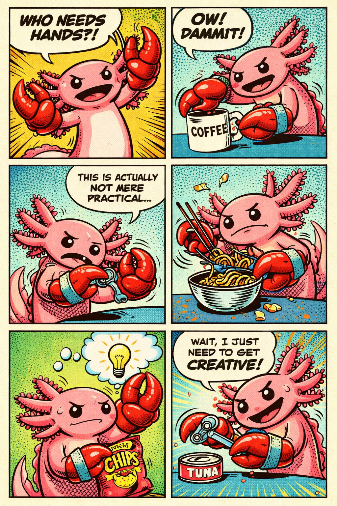

# Axle The ClawFish — Story Bible

## Characters

### Axle (protagonist)
- **Species:** Axolotl
- **Color:** Pink, classic axolotl design
- **Personality:** Timid, shy, insecure about his appearance — but has hidden fire
- **Secret:** Has a multicolor shiny tail he isn't even aware of. He's always looking in the mirror at his front, never turning around. The tail glows dimly when he gets mad but never fully ignites in color because he went searching for the lobster claw instead of discovering his own power
- **Arc:** Insecurity → seeking external power (the claw) → eventually discovering his own tail was the real gift all along
- **After the claw:** Wields it like Excalibur, calls himself "AX-CALIBER"
- **Key trait:** Too busy comparing himself to others to see what he already has

### The Lobster (mentor figure)
- **Species:** Lobster
- **Color:** Beautiful amber red like molten lava
- **Personality:** Master Oogway energy — old, wise, serene, sagacious. Never fully shown in the origin story (only POV arm/claw shots). Adds mystery
- **Details:** Has a rustic circle symbol tattoo on his RIGHT claw (the one he keeps). Faded scars suggest he's given claws away before
- **The claw he gives:** LEFT claw, detached. Has a tattoo of the letter "Q" in Braille dots — 5 filled circles and 1 empty circle for the 6th
- **Message:** "With great power comes great responsibility" — never said, only shown

### Betta Fish (antagonist)
- **Species:** Betta fish (Siamese fighting fish)
- **Color:** Blue with rainbow accents
- **Personality:** Vain, territorial, aggressive. Johnny Bravo energy — obsessed with his own reflection
- **Behavior:** Calm and self-admiring when alone. Fins snap up aggressively the moment he sees another fish

---

## Art Direction

### Style
- Retro pop art / comic book aesthetic
- Halftone dot patterns throughout
- Bold black outlines
- Bright saturated colors but NOT oversaturated
- White speech bubbles with bold uppercase hand-lettered text
- Minimal underwater bubbles — keep backgrounds clean

### Color Palette
- **Axle:** Pink body, multicolor tail (subtle, dim glow)
- **Betta:** Blue with rainbow colors
- **Lobster:** Amber red, molten lava tones
- **Backgrounds:** Teal/cyan water, yellow/green accent panels
- **Emotional color shifts:**
  - Calm scenes: cool blues
  - Anxious scenes: darker tones
  - Power moments: warm yellow/orange bursts
  - Triumph: EXPLOSIVE yellow/orange

### Title Design
- "AXLE THE CLAWFISH" in big bold retro comic book title lettering
- Red and yellow colors, slight 3D shadow effect, halftone dots in letters
- The "C" in "CLAWFISH" is shaped like a lobster claw
- The "A" in "CLAWFISH" is an UPSIDE-DOWN lobster claw silhouette forming the letter A

---

## Chapters

### Chapter 1 — Origin Story (prequel)

**Prompt guardrails:**
- NO speech bubbles EXCEPT the "AX-CALIBERRRRR" panel
- Pure visual storytelling
- Lobster NEVER fully shown — only POV arm shots
- Claw design must be CONSISTENT across all panels

**Panel 1:** Axle wandering lost, accidentally walks into an underwater fish clothing store ("FIN & FIT Section" sign). Axle starts looking at himself in the mirror trying to show cute aggression to appear fit. A blue betta fish is also at an oval mirror, posing, puckering fish lips — Johnny Bravo vanity. Fins relaxed. Betta hasn't noticed Axle. IMPORTANT: Axle's multicolor tail is visible to the reader but Axle is facing the mirror and doesn't see it.

**Panel 2:** Betta is looking in the mirror at itself. Axle is peering with his head turned, staring and admiring the betta fish. Axle's tail shows the faintest dim glow — reader notices, Axle doesn't.

**Panel 3:** Frustrated betta fish comes and tries to intimidate Axle. Axle scared, timid, tail curled between legs.

**Panel 4:** First-person POV from the lobster looking down at Axle. ONE lobster claw visible in foreground — the RIGHT claw with rustic circle tattoo. LEFT claw detached, being handed to Axle. Amber red molten lava coloring. Dramatic warm tones.

**Panel 5:** Axle staring at the offered claw with awe and uncertainty. One small hand timidly reaching toward it — barely about to touch, hesitant. Claw glows red/golden.

**Panel 6:** Camera from BELOW looking UP at Axle on a rock. Looking UP at the claw held sideways with BOTH arms HIGH above head. SAME claw design from panels 4-5. Eyes blazing. Yellow/orange explosion. Speech bubble: **"I AM AX-CALIBERRRRR!!"** — "AX" significantly larger.

---

### Chapter 2 — Who Needs Hands?!



Axle living life with his new lobster claws. Comedy of daily struggles:
1. "WHO NEEDS HANDS?!" — excited with both claws
2. "OW! DAMMIT!" — trying to hold a coffee mug, spilling
3. "This is actually not mere practical..." — struggling with chopsticks and noodles
4. Noodles flying everywhere, claw crushing the bowl
5. Lightbulb moment — idea while holding a bag of chips with the claw
6. "Wait, I just need to get CREATIVE!" — using the claw as a can opener on a tuna can

---

### Chapter 3+ — Future

**Planned story beats:**
- Axle at home alone at night, angry he's not as bright/colorful as the others
- Axle's tail starts glowing more as he gets emotional — but he never looks
- The moment Axle finally turns around and sees his own tail
- Return of the lobster? The tattoo symbol explained?
- Betta fish redemption arc?

---

## Character Development Tracking

### Axle's Tail (CRITICAL)
The multicolor tail is the central metaphor. Track its state across chapters:

| Chapter | Tail State | Axle Aware? |
|---------|-----------|-------------|
| 1 (Origin) | Visible but dim, faint glow when mad | No — facing mirror |
| 2 (Hands) | Hidden — focus is on the claws | No |
| 3+ | Glows brighter with each emotional moment | Still no |
| Climax | Full radiant color explosion | FINALLY YES |

The tail never fully glows in color because Axle chose to chase the lobster claw (external power) instead of discovering what he already had. The claw is borrowed strength. The tail is his.

---

## Prompt Template

For generating new chapters in the same style, always include:

```
Create a 6-panel comic strip in the EXACT same art style as the attached
image — same retro pop art/comic book aesthetic with halftone dot patterns,
bold black outlines, bright saturated colors but NOT oversaturated, white
speech bubbles with bold hand-lettered text, and the same character design
for the pink axolotl (Axle). MINIMIZE underwater bubbles — keep backgrounds
clean.

Characters:
- Axle: pink axolotl with multicolor tail (he doesn't know about it)
- Betta: blue with rainbow, vain, territorial
- Lobster: amber red molten lava, Master Oogway energy, never fully shown

Title: "AXLE THE CLAWFISH" with claw-shaped C and upside-down claw A

[Panel descriptions here]

IMPORTANT: Match the EXACT art style. Consistent character designs across
all panels. Axle's tail is always visible to the reader but Axle never
notices it.
```
